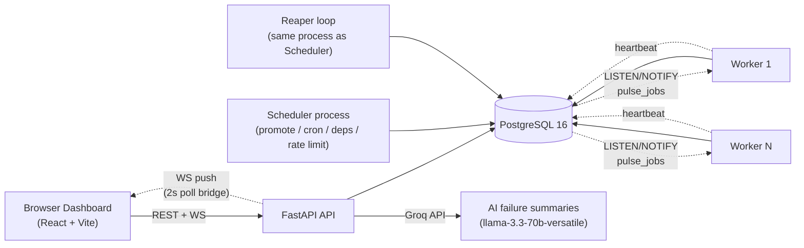
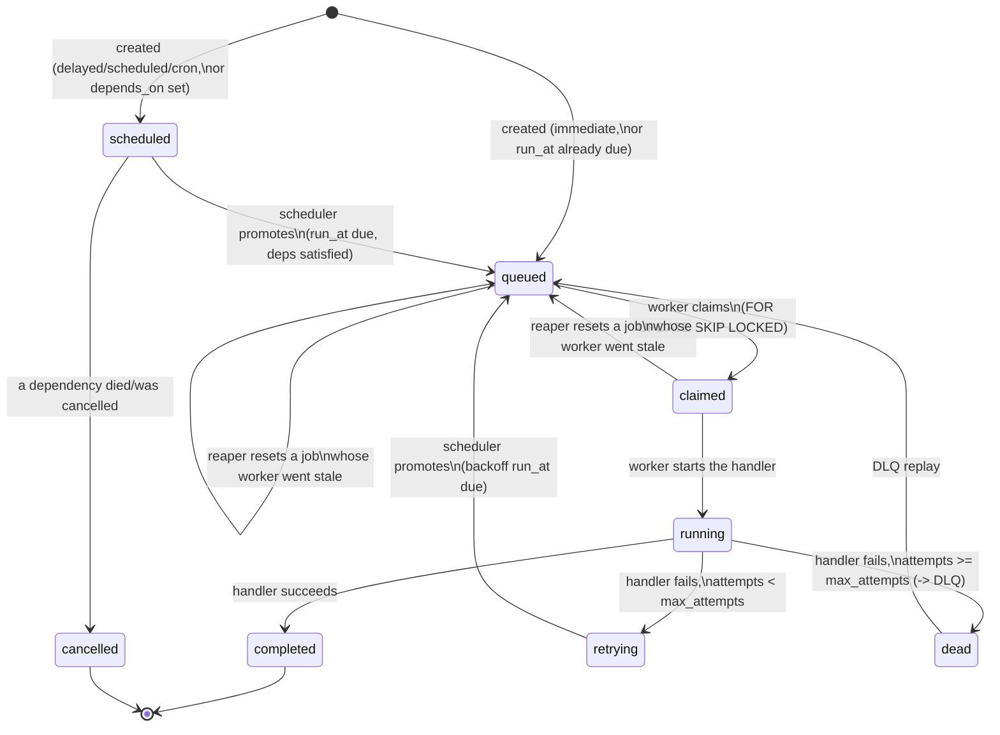

# Architecture

Pulse is five processes sharing one Postgres database: no Redis, no message
broker — `FOR UPDATE SKIP LOCKED` plus `LISTEN/NOTIFY` do the jobs a second
datastore would normally be reached for (see
[design-decisions.md](./design-decisions.md) for why).

## Processes and responsibilities

| Process | Container | Responsibilities |
|---|---|---|
| **API** | `api` | Auth (JWT), CRUD for orgs/projects/queues/jobs/retry-policies/workers, enqueue, retry/cancel, DLQ replay, metrics endpoints, WS fan-out. **Never executes a job handler.** |
| **Scheduler** | `scheduler` | Every `SCHED_TICK_SEC` (1s): promotes due `scheduled`/`retrying` jobs to `queued` (rate-limited per queue where configured), fires cron/recurring templates, resolves workflow dependencies. Runs the reaper as a second concurrent loop in the same process (every `REAPER_TICK_SEC`, default 5s). |
| **Worker** | `worker` (scalable: `docker compose up --scale worker=N`) | Polls its subscribed queues, atomically claims a batch bounded by remaining concurrency, runs handlers concurrently under a semaphore, sends heartbeats, completes/fails jobs, hands failures to the retry engine. LISTENs on `pulse_jobs` for instant wake-up instead of waiting out its poll interval. Graceful shutdown on SIGTERM. |
| **Seed** | `seed` (one-shot) | Idempotent: creates the demo org/user/project/retry-policy/queues + a mix of immediate/delayed/batch/cron/failing jobs on first boot, then exits. |
| **Frontend** | `frontend` | Vite build served by nginx in production (dev server + proxy locally); nginx also proxies `/api` (incl. WS upgrade) to the `api` container. |

## Data flow: one job's life

## Why this shape

- **API never runs job code.** Keeping execution entirely in worker
  processes means the API's request/response latency is never at the mercy
  of a job handler (an `http_call` hitting a slow endpoint, a `sleep`, ...).
- **Scheduler and reaper share a process** because they're both lightweight,
  low-frequency background loops with no per-request latency requirement —
  running them as two `asyncio` tasks in one container is simpler ops than
  two containers for work this small, without losing either loop's ability
  to fail/restart independently in principle (they're just two `asyncio.gather`
  coroutines; a crash in one is caught and logged per-tick, not fatal to the
  process).
- **Workers scale horizontally trivially** (`docker compose up --scale
  worker=N`) because all coordination — atomic claim, concurrency ceiling,
  crash recovery — lives in Postgres, not in worker-to-worker communication.
  Verified under real 3-worker contention in Phase 5 (see design-decisions.md
  §4, distributed locking).
