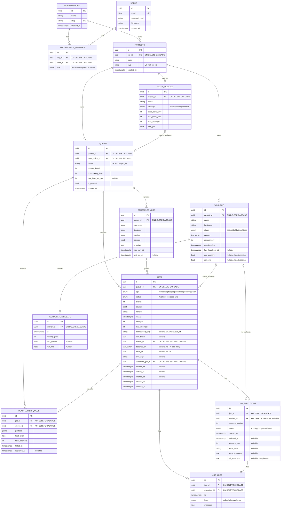

# ER diagram

All 13 tables from spec §4, exactly as migrated in
`backend/alembic/versions/0001_initial_schema.py` (verified against a live
Postgres in Phase 1 — every FK/index/cascade below is what's actually in the
database, not just what was planned).

## Indexes that carry real query load

- **`idx_jobs_claim (queue_id, status, priority DESC, run_at)`** — the claim
  query's entire `WHERE queue_id=... AND status='queued' AND run_at<=now()
  ORDER BY priority DESC, run_at ASC` is served by this one composite index.
- **`idx_jobs_due (run_at) WHERE status IN ('scheduled','retrying')`** —
  partial index backing the scheduler's due-scan; rows in any other status
  (the overwhelming majority once a system's been running a while —
  completed/failed/dead/cancelled) never bloat it.
- **`uq_jobs_idem (queue_id, idempotency_key) WHERE idempotency_key IS NOT
  NULL`** — a partial *unique* index, so idempotency is enforced by Postgres
  itself, not just application logic, and jobs without a key (the common
  case) don't pay for an index entry.
- **`idx_heartbeats_worker_ts (worker_id, ts DESC)`** and **`idx_dlq_queue_failed
  (queue_id, failed_at DESC)`** — both back "most recent N for this
  worker/queue" queries the dashboard makes constantly (utilization charts,
  DLQ list).

## depends_on and batch_id have no FK — on purpose

Both are plain `uuid[]` / `uuid` columns, not foreign keys. Postgres has no
native way to express "array of FKs" (`uuid[] REFERENCES jobs(id)` isn't
valid DDL), and a batch's `batch_id` is a *grouping* value shared by N rows,
not a reference to a single parent row — there's no one row for it to point
at. Both are handled at the application layer instead: `_validate_depends_on`
checks referenced jobs exist at creation time, and the scheduler's
`resolve_dependencies` step re-checks their live status on every tick.
